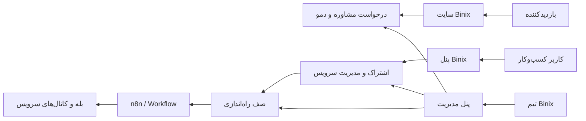

# معرفی محصول Binix

## تعریف قطعی

Binix یک لایه تجاری و مدیریتی برای سرویس‌های هوشمند کسب‌وکار است. سایت قرار نیست منطق اصلی همه سرویس‌ها را داخل Next.js اجرا کند. وظیفه سایت شامل معرفی سرویس، جذب سرنخ، احراز هویت، مدیریت کسب‌وکار، خرید و اشتراک، تنظیم اتصال، پشتیبانی و نظارت عملیاتی است. اجرای workflowهای سرویس‌ها در n8n و تجربه نهایی بعضی سرویس‌ها در کانال‌هایی مانند بله انجام می‌شود.

## مسئله‌ای که حل می‌شود

کسب‌وکارهای کوچک و متوسط معمولاً ابزارهای پراکنده‌ای برای فروش، پاسخ‌گویی، رزرو و گزارش دارند. Binix تلاش می‌کند:

- شروع استفاده از اتوماسیون و هوش مصنوعی را قابل‌فهم کند؛
- راه‌اندازی و وضعیت سرویس‌ها را در یک پنل متمرکز کند؛
- ارتباط میان کسب‌وکار، اشتراک، سرویس و workflow اجرایی را قابل پیگیری کند؛
- برای موارد حساس امکان مدیریت انسانی، پشتیبانی و Audit ایجاد کند.

## کاربران اصلی

| کاربر | نیاز اصلی |
|---|---|
| بازدیدکننده | شناخت سرویس و ثبت درخواست مشاوره یا دمو |
| مالک کسب‌وکار | خرید، مدیریت اشتراک و تنظیم سرویس |
| عضو کسب‌وکار | مشاهده سرویس‌ها در محدوده دسترسی کسب‌وکار |
| پشتیبانی | مدیریت تیکت و درخواست‌های مشاوره |
| مالی | مشاهده پلن، سفارش، پرداخت و مغایرت‌ها |
| مدیر | مدیریت کاربران، کسب‌وکارها، کاتالوگ و عملیات |
| مدیر ارشد | مدیریت نقش‌ها و مجوزهای سامانه |

## ارزش پیشنهادی

- یک نقطه واحد برای معرفی، خرید و مدیریت سرویس‌های هوشمند
- جداسازی تجربه کاربر از پیچیدگی workflowهای n8n
- کنترل دسترسی، گزارش تغییرات و مدیریت امن credentialها
- امکان افزودن سرویس‌های جدید از کاتالوگ پویا
- تجربه فارسی، RTL و متناسب با کسب‌وکار ایرانی

## مدل کسب‌وکار محتمل

مدل فعلی کد بر فروش پلن و اشتراک مستقل برای هر سرویس بنا شده است. قیمت‌گذاری نهایی هنوز تصمیم‌گیری نشده؛ بنابراین وجود مدل‌های `ServicePlan`، `Subscription`، `Order` و `Payment` به‌معنی نهایی بودن تعرفه یا درگاه پرداخت نیست.

## مرز مسئولیت

## موارد نیازمند تصمیم

- قیمت و شرایط تجاری هر سرویس
- درگاه پرداخت و قرارداد webhook آن
- ارائه‌دهنده پیامک OTP
- قرارداد دقیق ورودی/خروجی هر workflow در n8n
- سیاست نگهداری داده، حریم خصوصی و حذف حساب
- SLA تجاری نهایی پشتیبانی

