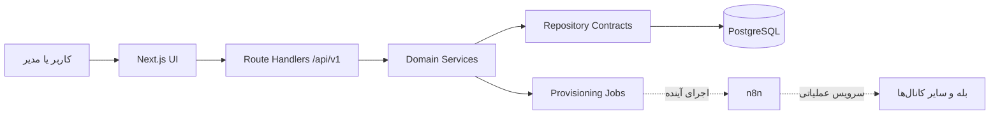

# نمای کلی معماری

## تصویر کلان

Binix یک برنامه‌ی Next.js واحد است که رابط کاربری عمومی، پنل کاربر، پنل مدیریت و API را ارائه می‌کند. داده‌ی پایدار در PostgreSQL ذخیره می‌شود و Prisma لایه دسترسی به دیتابیس است.

## مسئولیت اجزا

| جزء | مسئولیت |
|---|---|
| صفحات عمومی | معرفی محصول، جذب سرنخ و هدایت به مشاوره یا دمو |
| پنل کاربر | مدیریت کسب‌وکار، سرویس، اشتراک، صورتحساب، اعلان و تیکت |
| پنل مدیریت | مدیریت مشتری، محصول، فروش، عملیات، نقش‌ها و گزارش تغییرات |
| API | اعتبارسنجی، اعمال دسترسی، اجرای قواعد دامنه و پاسخ استاندارد |
| Repository | جداسازی منطق محصول از نوع منبع داده |
| PostgreSQL | منبع اصلی هویت، کسب‌وکار، کاتالوگ، مالی و عملیات |
| n8n | اجرای workflowهای واقعی سرویس‌ها و اتصال به کانال‌های بیرونی |

## حالت‌های اجرای داده

- `BINIX_DATA_DRIVER=database`: حالت اصلی؛ repository دیتابیسی و PostgreSQL منبع حقیقت است.
- `BINIX_DATA_DRIVER=mock`: فقط برای توسعه یا نمایش مستقل؛ داده در فایل‌ها/volumeهای mock نگهداری می‌شود.

کانتینر عملیاتی فعلی با compose تکمیلی PostgreSQL باید در حالت `database` اجرا شود. endpoint سلامت باید `dataDriver: database` برگرداند.

## جریان یک درخواست

1. درخواست وارد Route Handler می‌شود.
2. wrapper مشترک، شناسه درخواست و مدیریت خطا را اعمال می‌کند.
3. احراز هویت و مجوز در سمت سرور کنترل می‌شود.
4. service دامنه قواعد کسب‌وکار را اجرا می‌کند.
5. repository داده را می‌خواند یا تغییر می‌دهد.
6. عملیات حساس در Audit Log ثبت می‌شود.
7. پاسخ با envelope استاندارد API بازگردانده می‌شود.

## مرزهای امنیتی

- وجود cookie در middleware به‌تنهایی مجوز نیست؛ session و permission باید در API تأیید شوند.
- secretهای سرویس قبل از ذخیره با AES-256-GCM رمز می‌شوند.
- اطلاعات محرمانه نباید در پاسخ API، Audit Log یا مستندات ثبت شوند.
- تمام queryهای مدیریتی باید tenant و permission را صریحاً رعایت کنند.

## وضعیت فعلی

- برنامه، دیتابیس، migration، seed و Docker عملیاتی‌اند.
- repository دیتابیسی در endpoint سلامت تأیید شده است.
- مدیریت connector و صف provisioning وجود دارد.
- executor واقعی n8n و قرارداد production آن هنوز تکمیل نشده است.

