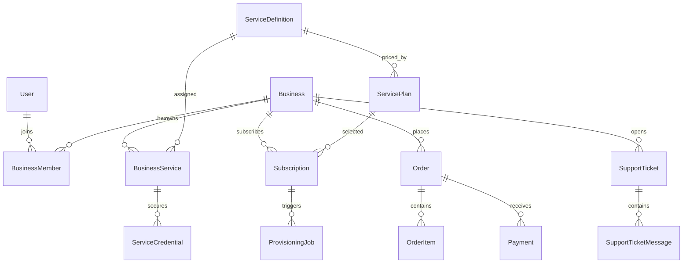

# مدل داده

نسخه کامل و قابل مشاهده روابط در [نمودار ER کامل](erd.md) قرار دارد.

## دامنه‌های اصلی

| دامنه | مدل‌ها |
|---|---|
| هویت و دسترسی | `User`, `OtpChallenge`, `AuthSession`, `AccessRole`, `AccessRolePermission` |
| مشتری | `Business`, `BusinessMember` |
| محصول | `ServiceDefinition`, `BusinessService`, `ServiceCredential` |
| فروش | `ServicePlan`, `Subscription`, `Order`, `OrderItem`, `Payment` |
| عملیات | `AutomationConnector`, `ProvisioningJob`, `Notification` |
| پشتیبانی | `SupportTicket`, `SupportTicketMessage` |
| بازاریابی و کنترل | `ConsultationLead`, `AuditLog` |

## رابطه ساده‌شده

## قواعد داده

- شناسه‌های دامنه عموماً UUID هستند؛ شناسه سرویس رشته‌ای پایدار مانند `sales-agent` است.
- مبلغ مالی با integer بزرگ و واحد ریال ذخیره می‌شود؛ تبدیل نمایشی به تومان وظیفه UI است.
- credential فقط به‌صورت `encryptedValue` ذخیره می‌شود.
- ارتباط‌های مالکیتی حساس باید از طریق `BusinessMember` و نقش عضویت بررسی شوند.
- حذف cascade فقط برای داده‌ای مجاز است که بدون والد معنای مستقل ندارد؛ سرویس مرجع روی روابط حساس `RESTRICT` است.
- تمام timestampهای پایگاه داده باید timezone-aware و مبنای عملیاتی UTC داشته باشند.

## وضعیت‌های مهم

- سرویس کاتالوگ: `active`, `draft`, `disabled`
- دسترسی عمومی: `public`, `private`
- آمادگی: `available`, `coming-soon`
- چرخه subscription/order/payment/provisioning در schema تعریف شده و تغییر آن باید فقط از service دامنه انجام شود.

## tenant و حریم داده

مرز tenant، `Business` است. هر query مرتبط با سرویس، اشتراک، سفارش، پرداخت، تیکت یا credential باید business مجاز کاربر را محدود کند. دانستن یک UUID نباید امکان مشاهده داده کسب‌وکار دیگر را بدهد.

## تغییر مدل

هر تغییر schema نیازمند migration، generate، typecheck، تست repository/API، بررسی قواعد حذف، به‌روزرسانی seed و اصلاح این سند است.
