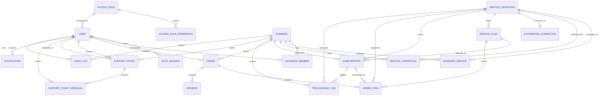
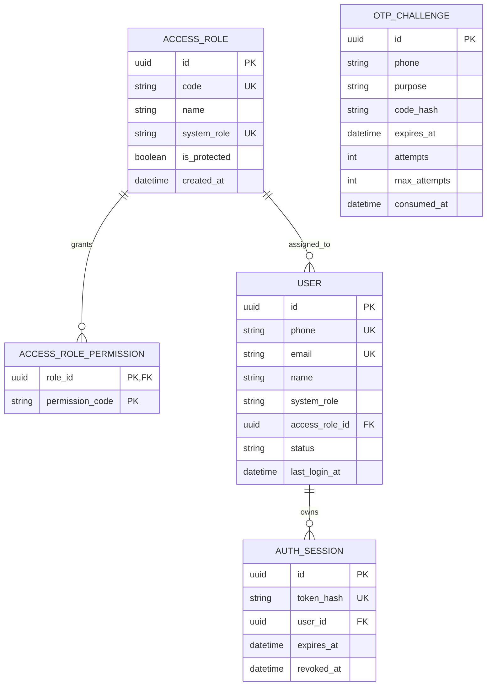
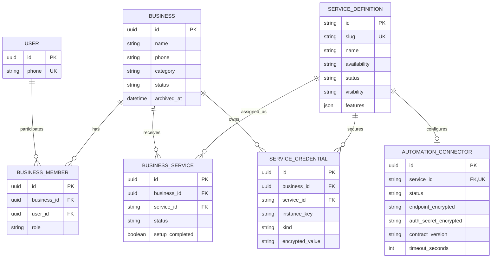
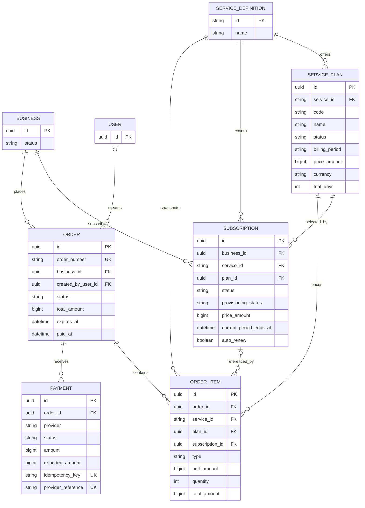
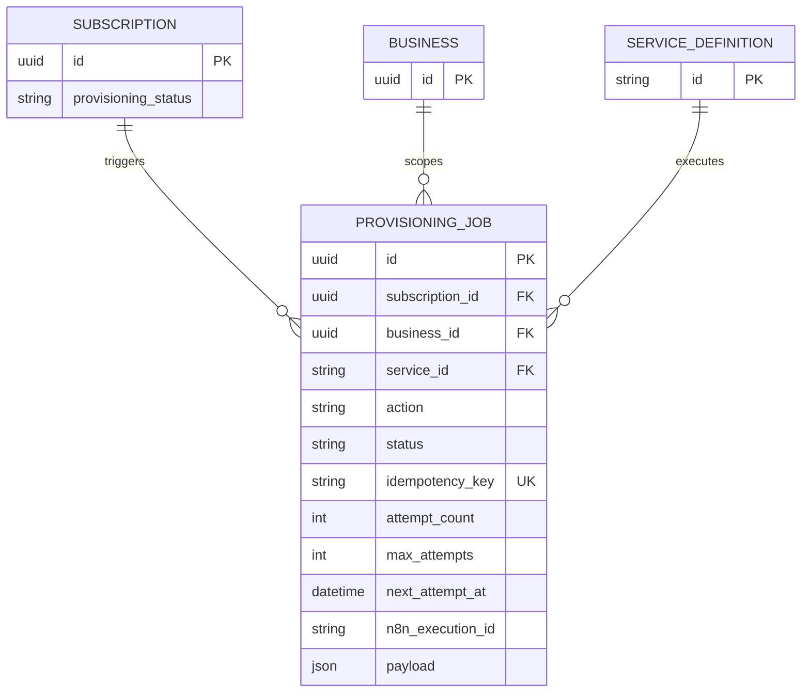
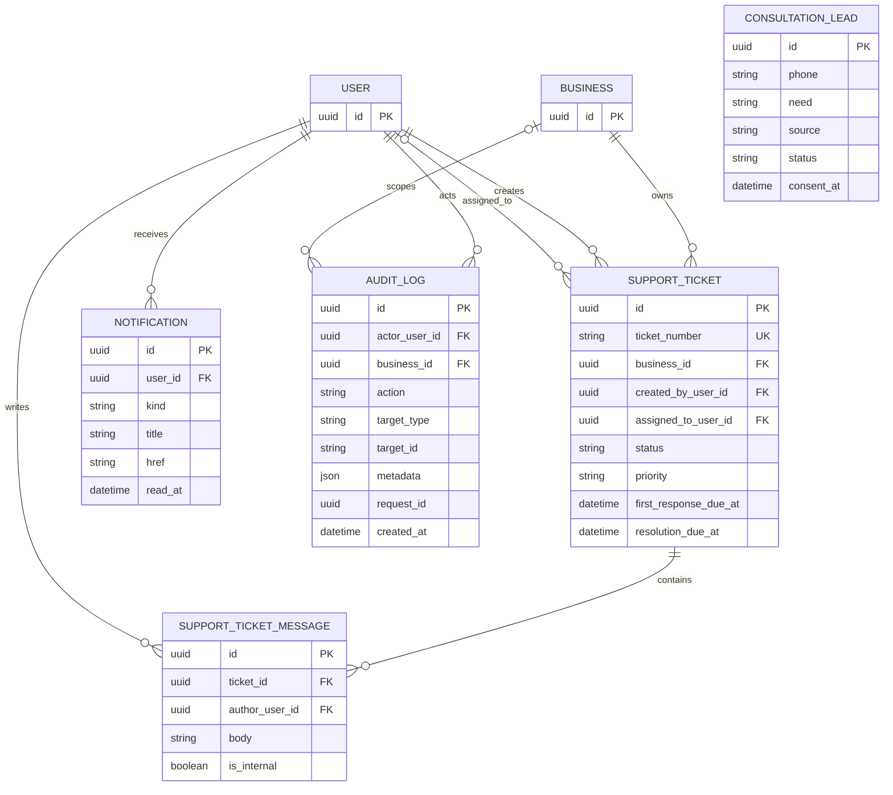

# نمودار ER کامل Binix

این سند مستقیماً از `prisma/schema.prisma` استخراج شده است. در تاریخ ۲۰۲۶-۰۸-۲۷، schema شامل ۲۲ مدل Prisma است. نمودار اول همه روابط را نشان می‌دهد؛ نمودارهای بعدی برای خوانایی، جزئیات هر دامنه را جدا می‌کنند.

## راهنمای علائم

- `PK`: کلید اصلی
- `FK`: کلید خارجی
- `UK`: مقدار یکتا
- `||`: دقیقاً یک
- `o|`: صفر یا یک
- `o{`: صفر تا چند

## نمای جامع روابط

`OTP_CHALLENGE` و `CONSULTATION_LEAD` در schema فعلی Foreign Key ندارند و بنابراین در نمودار رابطه‌ای بالا جدا هستند.

## هویت و دسترسی

نکته: `User.systemRole` برای سازگاری و bootstrap نگهداری می‌شود؛ نقش مدیریتی قابل‌کنترل با `accessRoleId` به `AccessRole` متصل است.

## کسب‌وکار و کاتالوگ سرویس

قیود ترکیبی مهم:

- `BusinessMember`: عضویت با `(businessId, userId)` یکتا است.
- `BusinessService`: تخصیص با `(businessId, serviceId)` یکتا است.
- `ServiceCredential`: ترکیب `(businessId, serviceId, instanceKey, kind)` یکتا است.
- `AutomationConnector`: برای هر سرویس حداکثر یک connector وجود دارد.

## فروش، اشتراک و پرداخت

مبالغ به ریال در `BigInt` ذخیره می‌شوند. `OrderItem` و `Subscription` snapshot قیمت و پلن را نگه می‌دارند تا تغییر آینده پلن، سوابق مالی را عوض نکند.

## عملیات و n8n

وجود `ProvisioningJob` نشان‌دهنده صف و وضعیت داخلی است؛ تا زمان تکمیل worker و callback، رابطه فوق به معنی اجرای end-to-end n8n نیست.

## پشتیبانی، اعلان و Audit

## رفتار حذف روابط

| رابطه | `onDelete` |
|---|---|
| Role → Permission | `CASCADE` |
| User → Session/Notification | `CASCADE` |
| Business/User → BusinessMember | `CASCADE` |
| Business → BusinessService/Credential | `CASCADE` |
| ServiceDefinition → AutomationConnector | `CASCADE` |
| ServiceDefinition در تخصیص، پلن، فروش و عملیات | عمدتاً `RESTRICT` |
| User → Order creator / Ticket assignee | `SET NULL` |
| Business → AuditLog | `SET NULL` |
| Ticket → Message | `CASCADE` |
| موجودیت‌های مالی و اشتراک | عمدتاً `RESTRICT` |

این جدول برای درک سریع است؛ مرجع قطعی همیشه `prisma/schema.prisma` و migrationهای اعمال‌شده هستند.

